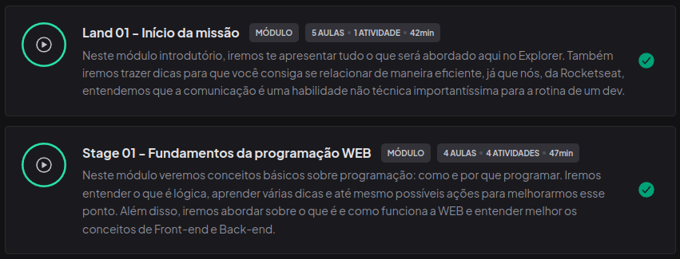
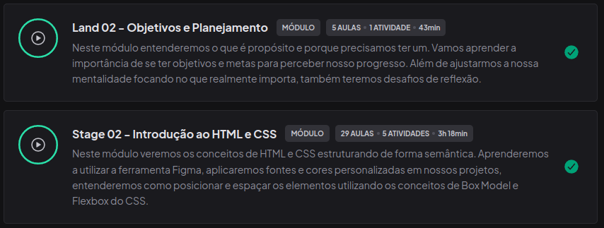

<h3 align="center">
  Repositório Formação Explorer RocketSeat - 2024
</h3>

<blockquote align="center">“Não espere resultados brilhantes se suas metas não forem claras”!</blockquote>
</br></br>

## Módulo 01 - Fundamentos da Web



</br>

## Módulo 02 - Introdução ao HTML e CSS



</br></br>

## Instalação e execução

<p>Para obter todos os projetos que compoem este repositório faça:</p>

```bash
# Clone esse repositório
$ git clone https://github.com/cleyton1986/rocketseat-formacao-explorer-2024

# Será criado a pasta 'rocketseat-formacao-explorer-2024', Entre no diretório usando
$ cd rocketseat-formacao-explorer-2024

# Alguns dos projetos são arquivos .html, basta dar dois cliques nele que o site abrirá
# Em outros casos terá que instalar as dependências, usando;
$ npm install

# Rode para gerar a pasta build com os arquivos de produção
$ npm run build

# para rodar a aplicação, execute o comando
$ npm run dev

# Rode os testes (se houver)
$ npm run test
```

## Licença

Esses projetos estão sob a licença MIT. Veja o arquivo [LICENSE](LICENSE) para mais detalhes.

---

Developed by 🖖🏽 Cleyton Alves 👨🏽‍💻 Inspired by RocketSeat 🚀


