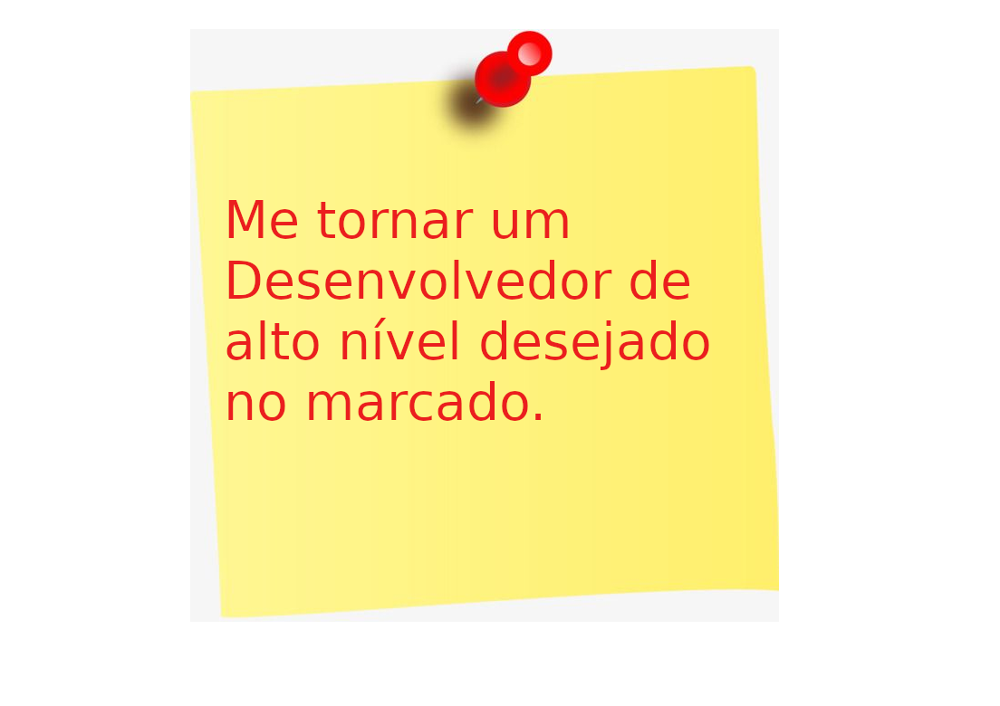

# Land 02 - Objetivos e planejamento

Faaaaaala, dev! Beleza? 💜
Agora que você aprendeu a importância de definir propósito e traçar objetivos, bora fixar isso?

# 💻 Sobre o desafio

Esse desafio é dividido em duas partes:

**Parte 1**
Use as dicas passadas na aula e defina o seu propósito e quais objetivos que vão te ajudar a chegar lá.

- Conta pra gente: qual o seu propósito?
- Quais objetivos você traçou para alcançar esse propósito?

**Parte 2**
Bora escrever seu propósito e seus objetivos em um papel e deixar em um lugar fixo no seu setup? É importante que isso sempre esteja próximo de você para que você continue firme e buscando evoluir diariamente! 💜

# 📅 Entrega

A primeira parte deste desafio deve ser entregue a partir da plataforma da Rocketseat.
Crie um documento público no Notion ou outra plataforma de sua preferência (Google Sheets ou outro) **respondendo às questões** e nos envie o link. 💜

A segunda parte: bora postar no LinkedIn o seu setup com esse papel?
Você pode encontrar pessoas com o mesmo propósito e fazer um bom networking ali! 😍
Obs: Se você se sentir à vontade, pode nos marcar!
Vai ser incrível acompanhar a sua evolução! 💜

# Esse desafio foi entregue na plataforma da Rocketseat

- **`Parte 01`**:

```md
- Qual o seu propósito?

  Resposta: Me tornar um Desenvolvedor alto de alto nível desejado no marcado.
```

```md
- Quais objetivos você traçou para alcançar esse propósito?

  Resposta: Tracei um cronograma de estudos; onde separei 4 horas do meu dia, 7 dias por semana. Onde começarei pela Formação Explorer e depois farei todas as trilhas do Ignite.
```

- **`Parte 02`**:

<p align="center">
    
</p>

Developed by 🖖🏽 Cleyton Alves 👨🏽‍💻 Inspired by RocketSeat 🚀
