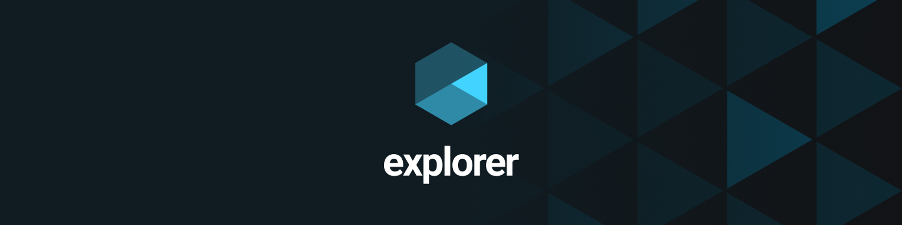

# Desafio intermediário - Recriando layout

# 💻 Sobre o desafio

Nesse desafio, você deverá recriar uma aplicação, a partir de um layout pronto no Figma, para fortalecer alguns conceitos aprendidos nessa aula, entre eles:

- Estruturando um projeto HTML;
- Uso de tags HTML mais comuns;
- Conceitos iniciais de CSS;
- Posicionamento e alinhamento de elementos na tela;
- Aplicando fontes customizadas;
- Espaçamentos.

## Layout da aplicação

O Figma está disponível nesse **[link](https://www.figma.com/file/waisYRoNzeBgIxOyrz0b2R/Projeto01-Extra/duplicate).** Abaixo você consegue visualizar a carinha da aplicação:


<aside>

⚠️ **Alerta**: Caso ao clicar no link você se depare com o erro que `WebGL` não está ativado no seu navegador,
[siga esses passos](https://help.figma.com/hc/en-us/articles/360039828614#Enable_WebGL).

</aside>

## Quais arquivos devo criar na minha aplicação?

Além de criar a pasta **images**, que irá conter as imagens da sua aplicação, seu projeto deverá ter os seguintes arquivos:

- index.html
- style.css

## Quer se desafiar ainda mais?

Que tal se desafiar e adicionar um **Favicon** no seu projeto? 👀💜
Um Favicon (junção das palavras em inglês _favorite_ + _icon_) é aquela imagenzinha que fica do lado do título da sua aplicação no navegador:


<aside>
💡 Dicas

</aside>

- No Figma da aplicação você pode notar que temos uma imagem já disponível para o Favicon! Basta você copiar como SVG e adicionar dentro da sua pasta images:


Para adicionar dentro da sua pasta images, basta criar um arquivo com o nome de sua preferência, com a extensão .svg e colar o código copiado do Figma.


Prontinho!
Agora é só trabalhar com essa imagem lá no seu arquivo index.html! 💜

Por ser algo que não foi passado em aula, já vou deixar a solução por aqui caso você tenha alguma dificuldade, tudo bem? 💜

- Solução para adicionar Favicon

  ```html
  <link rel="shortcut icon" href="images/favicon.svg" type="image" />
  ```

## 📅 Entrega

Esse desafio deve ser entregue a partir da plataforma da Rocketseat.
Você pode nos enviar o link do CodePen ou GitHub com o seu código. 💜

Após concluir o desafio, que tal fazer um post no LinkedIn compartilhando o seu aprendizado e contando como foi a experiência?
É uma excelente forma de demonstrar seus conhecimentos e atrair novas oportunidades! 😍
Obs: Se você se sentir à vontade, pode postar um print do resultado final e nos marcar!

Vai ser incrível acompanhar a sua evolução! 💜

Feito com 💜 por Rocketseat 👋 Participe da nossa [comunidade aberta!](https://discord.gg/Ns86RQyVH8)
